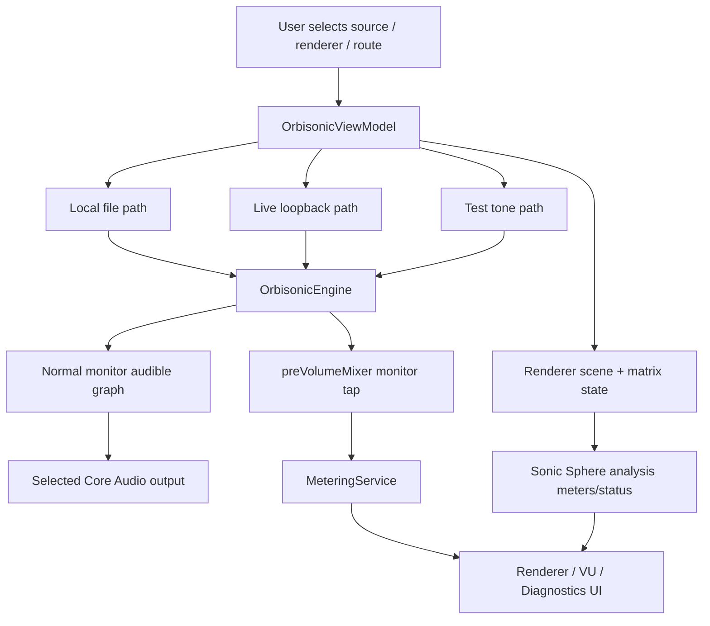

# Orbisonic Audio System Flow, Rendering, Timing, And Rewrite Context

## Purpose

This document is a source-grounded map of Orbisonic's current audio system as of
2026-05-26. It exists because the current audio does not sound right, several
fix attempts have not resolved the issue, and a full rewrite is under
consideration.

This is not a fix proposal by itself. It is the context needed before changing
or replacing the engine. It separates what the current app actually does from
what the project intends to support.

Primary source files:

- `Sources/Orbisonic/OrbisonicEngine.swift`
- `Sources/Orbisonic/OrbisonicViewModel.swift`
- `Sources/Orbisonic/LiveAudioBridge.swift`
- `Sources/Orbisonic/LoopbackSourceSupport.swift`
- `Sources/Orbisonic/RendererModule.swift`
- `Sources/Orbisonic/RendererMatrixSampleRenderer.swift`
- `Sources/Orbisonic/NormalMonitorStereoDownmixer.swift`
- `Sources/Orbisonic/NormalMonitorGraphTopology.swift`
- `Sources/Orbisonic/NormalMonitorRouteDescriptor.swift`
- `Sources/Orbisonic/OutputRouteMonitor.swift`
- `Sources/AudioCore/RenderGraphPlan.swift`
- `Sources/AudioCore/RenderKernels.swift`
- `Sources/AudioCore/OutputAdapters.swift`
- `Sources/AudioCore/SourceAdapters.swift`
- `Sources/AudioCore/AudioSessionPlanning.swift`
- `Sources/AudioCore/MeteringTelemetry.swift`
- `docs/contracts.md`
- `docs/system-flows.md`
- `docs/test-strategy.md`
- `docs/audits/0003-callback-reachability-audit.md`
- `docs/audits/0004-callback-safety-performance-gates.md`
- `docs/audits/0005-realtime-family-compliance-final-audit.md`

## Executive Summary

The current app has two overlapping audio worlds:

1. The current audible AVAudioEngine path.
2. The renderer, Dante, and Sonic Sphere planning path.

Those worlds are not the same thing right now.

The current audible path for local files and live loopback sources is a normal
monitor path:

```text
selected source PCM
-> one mono AVAudioPlayerNode or AVAudioSourceNode per source channel
-> per-channel AVAudioUnitMixer gain and pan
-> preVolumeMixer
-> outputGainMixer
-> mainMixerNode
-> selected Core Audio output device
```

The current renderer and Sonic Sphere path builds scene models, matrices,
analysis meters, status, and tests. However, direct renderer audio is disabled
in the app policy:

```text
RendererAudioRoutingPolicy.usesDirectRendererAudio(...) == false
```

For live input, the audible source nodes call:

```text
LiveAudioPipe.render(channelIndex:audioBufferList:frameCount:)
```

They do not call the matrix renderer:

```text
LiveAudioPipe.render(matrix:audioBufferList:frameCount:)
```

This matters. If the listener expects the Sonic Sphere 30.1 renderer to be the
audible output, the current app may instead be feeding a stereo normal monitor
branch. Fixing renderer UI, renderer meters, or Sonic Sphere analysis can leave
the audible sound unchanged if the audible graph is still the normal monitor
path.

The most likely architectural explanations for "the audio sounds wrong" are:

- The app is currently auditioning the normal monitor downmix rather than a
  direct Sonic Sphere/Dante production render.
- Channel identity or channel order is being lost between source import,
  fallback layout detection, per-channel node construction, and monitor pan/gain.
- Live capture is receiving a different channel count than the upstream player
  is actually sending.
- Live capture is receiving silence or underflowing while upstream metadata says
  playback is active.
- Sample-rate mismatch exists between Roon, the loopback input, the selected
  output, and the intended production route.
- Per-channel source nodes are used for local and live playback. That can make
  channel-level scheduling, phase, and alignment harder to reason about than a
  single multichannel source node or output unit.
- The live pipe intentionally buffers about 150 ms by default, with high-water
  trimming and underflow counters. Buffer churn can sound wrong even when meters
  move.
- Meters can be analysis or monitor snapshots, not proof of actual physical
  Sonic Sphere/Dante output.
- Realtime callback compliance is not complete. Known allocation and proof gaps
  remain.

## Binding Product Constraints

Orbisonic is a native Swift macOS app for routing, monitoring, and rendering
multichannel spatial audio for Sonic Sphere.

Important constraints from current contracts:

- Sonic Sphere 30.1 is the primary production topology.
- The headphone or normal monitor path is for setup, checking, and preview.
- The monitor path must not redefine or mutate the production topology.
- Roon, Spotify, Aux Cable, Local Files, and Test Tone are selected-source paths,
  not an implicit mixer.
- Local file playback and live loopback capture are separate paths.
- Orbisonic renders channel beds or discrete channels exposed by Core Audio or
  upstream tools.
- Orbisonic does not decode Dolby Atmos object metadata.
- Direct 30 and Direct 30.1 modes are bypass modes only when source width
  matches.
- Sample-rate mismatch, channel-count mismatch, route mismatch, underflow,
  dropped frames, and all-zero live input must remain visible diagnostic states.
- Metering must not consume live playback buffers or mutate audible output.
- Hardware-only behavior involving Sonic Sphere, Dante, Roon, Spotify, loopback
  devices, microphone permission, signing, installers, or service state requires
  manual verification.

## Mental Model

Think of the current app as five planes.

### 1. Control Plane

Owned mostly by:

- `Sources/Orbisonic/ContentView.swift`
- `Sources/Orbisonic/OrbisonicViewModel.swift`

Responsibilities:

- Source selection.
- Renderer mode selection.
- Output route selection.
- Roon, Spotify, Aux, Local, Test Tone, and dormant Atmos state.
- UI state.
- Web/control state.
- Diagnostics state.
- Source-switch fade timing.
- Live-signal state classification.

The control plane is mostly main-actor UI orchestration. It should not be the
owner of realtime audio correctness.

### 2. Source Plane

Owned by:

- Local file probing, loading, and streaming code in `Sources/Orbisonic/`.
- Live loopback setup in `Sources/Orbisonic/LiveAudioBridge.swift`.
- Roon parsing and bridge clients.
- Spotify receiver client.
- Aux loopback selection.

Responsibilities:

- Open local media.
- Convert or split source PCM into source-channel buffers.
- Select expected loopback devices.
- Validate source channel counts.
- Capture Core Audio input buffers from loopback devices.
- Publish source metadata and source health.

### 3. Realtime Callback Plane

Owned by:

- Core Audio HAL input callbacks.
- AVAudioSourceNode render callbacks.
- AVAudioPlayerNode scheduling.
- AVAudioEngine monitor taps.
- Meter ingestion.

This plane is where allocations, locks, waits, file I/O, route enumeration,
logging, UI calls, and dynamic data structure mutation are dangerous.

Current realtime-family status:

- The project has adopted realtime-family standards.
- HAL capture buffer allocation was moved out of the callback.
- Live ring buffers were rewritten away from callback-facing `NSLock`.
- Meter ingress was moved to fixed realtime state.
- Callback safety instrumentation exists.
- The project is still not realtime-family compliant.
- `LiveAudioPipe.render(matrix:)` still records scratch allocation in a
  callback-intended path.
- Host-level malloc/free, lock/wait interposition, denormal proof, and a real
  60-second standard stress run are still missing.

### 4. Renderer And Planning Plane

Owned by:

- `Sources/Orbisonic/RendererModule.swift`
- `Sources/Orbisonic/RendererMatrixSampleRenderer.swift`
- `Sources/AudioCore/RenderGraphPlan.swift`
- `Sources/AudioCore/RenderKernels.swift`
- `Sources/AudioCore/OutputAdapters.swift`

Responsibilities:

- Build Sonic Sphere scene models.
- Build renderer matrices.
- Represent 30 full-range channels plus LFE.
- Validate direct 30 and direct 30.1 bypass constraints.
- Represent desktop monitor and Dante production render plans.
- Produce analysis meters.

Critical current caveat:

The renderer plane is not currently the same as the audible AVAudioEngine output
path. The current direct renderer audio policy returns `false`.

### 5. Device And Route Plane

Owned by:

- `Sources/Orbisonic/OutputRouteMonitor.swift`
- `Sources/Orbisonic/LoopbackSourceSupport.swift`
- `Sources/AudioCore/SourceAdapters.swift`
- `Sources/AudioCore/AudioSessionPlanning.swift`

Responsibilities:

- Discover input and output routes.
- Identify expected Orbisonic loopback devices.
- Avoid feedback output routes.
- Identify Dante Virtual Soundcard capability.
- Validate sample-rate and channel-count compatibility.
- Keep route mismatch visible.

## Current High-Level Signal Flow



The important point is that the renderer scene and analysis branch can update
while the audible branch remains a stereo normal monitor graph.

## Source Selection Flow

Source switching is centered in `OrbisonicViewModel`.

Important source-switch constants:

- Ramp down: `0.04` seconds.
- Source prime: `0.08` seconds.
- Ramp up: `0.08` seconds.
- Local "play now" source-switch timeout: `2.0` seconds.

Typical source switch:

```text
user selection
-> coalesced source-switch request
-> ramp output down over 40 ms
-> stop or clear previous source state
-> apply selected source state
-> choose expected input/output route if needed
-> start local/live/test source
-> prime source briefly
-> ramp output up over 80 ms
```

This is useful for avoiding clicks, but it also means source switching has
observable state that can hide the first short piece of audio during startup,
especially with live sources that already have ring-buffer priming.

## Local File Playback Flow

### Local File Opening

The local path uses local file probing and loading, then hands prepared or
streamed PCM to `OrbisonicEngine`.

Broad flow:

```text
file URL
-> metadata/probe
-> codec/container/layout facts
-> channel count validation
-> PCM preparation or streaming
-> one mono buffer per source channel
-> one AVAudioPlayerNode per source channel
-> normal monitor gain/pan per channel
-> preVolumeMixer
-> outputGainMixer
-> mainMixerNode
-> selected Core Audio output
```

Important limits:

- The stable source-channel ceiling is 64 channels.
- Sources above the limit should be rejected, not silently truncated.
- Layout detection is used to assign channel roles when possible.
- Fallback layout is used when metadata is missing or weak.

### Prepared Local Playback

Prepared local playback builds one `AVAudioPlayerNode` per source channel.
Each player is fed a mono buffer for that channel.

Playback start timing:

```swift
mach_absolute_time() + AVAudioTime.hostTime(forSeconds: 0.03)
```

That means player nodes are asked to start together 30 ms in the future. This is
intended to align mono channel players. It is still more complex than rendering
from one interleaved or deinterleaved multichannel source callback with a single
timeline owner.

Seek and reschedule behavior slices mono buffers from the current frame and
schedules those slices on the player nodes. That path is not a realtime render
callback, but it is still part of audible timing behavior.

### Streaming Local Playback

The streaming path schedules chunks ahead of playback. Current guardrails include:

- Maximum scheduled-ahead duration: about 2 seconds.
- Maximum scheduled PCM bytes: 64 MiB.

Streaming and prepared playback share the same audible endpoint: the normal
monitor mixer graph.

### Local File Sound Risks

Current local-file risks for bad sound:

- Layout metadata can be missing, ambiguous, or low-confidence.
- Fallback channel roles may not match the actual media.
- MPEG 5.1, 7.1, and unusual container channel orders can be easy to mis-map.
- One mono player per channel makes channel alignment harder to prove than a
  single multichannel render timeline.
- The normal monitor path uses per-channel pan and gain instead of an explicit
  production Sonic Sphere render.
- LFE is muted by default in the normal monitor downmix.
- Multichannel monitor playback applies headroom and can sound quieter or less
  direct than expected.
- The renderer mode can change scene or meter state without changing the audible
  normal monitor output.

## Live Loopback Playback Flow

Live playback is for Roon, Spotify, Aux Cable, and the dormant Atmos DRP source.

Expected loopback roles:

- Roon: `Orbisonic Roon Input`
- Spotify: `Orbisonic Spotify Input`
- Aux: `Orbisonic Aux Cable`
- Atmos DRP: currently routed through the Aux policy while dormant/hidden

These loopbacks are source-staging devices. They are not Dante devices, and they
are not a mixer.

### Live Source Startup

Broad flow:

```text
selected live source
-> choose expected loopback input route
-> choose requested active channel count
-> validate route availability and channel count
-> build fallback source layout for requested channel count
-> create LiveAudioPipe
-> create LiveInputCapture
-> create one AVAudioSourceNode per active source channel
-> start AVAudioEngine
-> start HAL capture
-> source nodes read from LiveAudioPipe ring buffers
-> normal monitor gain/pan per channel
-> preVolumeMixer
-> outputGainMixer
-> mainMixerNode
-> selected Core Audio output
```

### Live Channel Count Policy

Current policy:

- Spotify has a fixed live channel count of 2.
- Roon supports selectable counts `[2, 4, 6, 8]`.
- Other live sources use renderer-supported input counts bounded by available
  input channels and the 64-channel source limit.
- Preferred count is the current active count if available, else 2 if available,
  else the first available count.

Implications:

- A 64-channel loopback device does not mean Orbisonic is capturing 64 active
  channels for Roon.
- Roon must be configured upstream to send the desired multichannel layout.
- Roon can show playback in its logs while Orbisonic is still receiving stereo,
  mono, silence, or the wrong sample rate.

### HAL Capture

`LiveInputCapture` configures a HAL output unit for input capture:

- Enable input on element 1.
- Disable output on element 0.
- Set the current input device.
- Set a Float32, native-endian, packed, non-interleaved stream format.
- Set `mChannelsPerFrame` to the capture channel count.
- Install an input callback.
- Start the audio unit.

Current maximum callback frame capacity:

```text
8,192 frames
```

`LiveInputCaptureBufferStorage` preallocates the AudioBufferList and channel
pointers before start. During the callback, it updates buffer byte sizes and
calls `AudioUnitRender`. Oversized callback blocks return
`kAudioUnitErr_TooManyFramesToProcess`.

### Live Pipe Buffering

`LiveAudioPipe` owns one `LiveChannelRingBuffer` per channel.

Default live latency:

```text
latencySeconds = 0.15
```

At 48 kHz this yields approximately:

```text
targetLatencyFrames = 7,200 frames = 150 ms
highWaterFrames = 12,600 frames = 262.5 ms
capacityFrames = 57,600 frames = 1.2 seconds
```

The formulas are:

```text
targetLatencyFrames = max(sampleRate * max(latencySeconds, 0.05), 512)
highWaterFrames = max(targetLatencyFrames * 1.75, targetLatencyFrames + 1024)
capacityFrames = max(sampleRate * max(latencySeconds * 8, 0.75), highWaterFrames * 2, 4096)
```

The ring buffer behavior is intentionally diagnostic:

- It primes until target latency is available.
- It outputs zeros during priming or underflow.
- It counts underflows and underflow frames.
- It trims old frames above high water.
- It counts overflow/drop frames.
- It has non-consuming peek for meters.

This buffering design can protect against immediate glitches, but if the capture
rate, render rate, route rate, or scheduling behavior does not line up, the
listener can hear silence, latency, intermittent underflow, or unstable channel
behavior while the app still appears active.

### Live Audible Render

The current audible live render path is per-channel:

```text
AVAudioSourceNode for channel N
-> LiveAudioPipe.render(channelIndex: N, ...)
-> output buffer 0 receives channel N
-> other buffers are zeroed
-> node volume and pan place channel into the stereo monitor graph
```

The live source node closure also checks `liveInputMuted` and clears output when
muted. That value is app-owned state read from the render closure and should be
treated carefully in any rewrite.

The direct matrix render path exists:

```text
LiveAudioPipe.render(matrix:audioBufferList:frameCount:)
```

But current source-node setup does not use it for audible live output. That path
also allocates scratch arrays and is currently one of the known realtime-family
compliance blockers.

### Live Signal Classification

Current live signal constants:

- Signal threshold: `0.005`.
- Startup grace: 3 seconds.
- Brief silence: 2 seconds.
- No-signal threshold: 15 seconds.

The view model classifies live signal state from meter peaks. This can produce
useful diagnostics, but it is not a substitute for channel-identity verification
or physical output verification.

### Live Sound Risks

Current live risks for bad sound:

- Wrong input route selected.
- Expected loopback route missing.
- Roon output sample rate differs from the loopback input nominal sample rate.
- Roon is configured to stereo while the app expects multichannel.
- Roon log metadata says playback is active while loopback capture is silent.
- Spotify is intentionally fixed to stereo.
- Aux can contain whatever the system or app sends, including unexpected
  downmixing before Orbisonic sees it.
- Active live channel count can be lower than the loopback device channel count.
- Ring buffers can underflow, trim, or drop frames.
- Per-channel AVAudioSourceNodes make cross-channel phase and timing harder to
  prove than a single multichannel render source.
- The normal monitor downmix, not the Sonic Sphere production renderer, is the
  audible branch.

## Normal Monitor Path

The normal monitor path is the current audible path for local and live source
auditioning.

Documented topology:

```text
sourcePCM
-> normalMonitorStereoDownmixer
-> outputGainMixer
-> mainMixerNode
-> systemOutput
```

Current engine implementation represents this as one mono node per source
channel, with per-channel node gain and pan derived from the same normal monitor
downmix coefficient policy.

Default monitor output gain:

```text
0.92
```

Monitor tap:

```text
preVolumeMixer.installTap(onBus: 0, bufferSize: 1024, format: nil)
```

The monitor tap observes the pre-volume mixer. It feeds monitor metering, not
the physical output device directly.

### Normal Monitor Coefficients

`NormalMonitorDownmixMatrix` defines the explicit stereo preview policy.

Important constants:

- Equal-power center: `0.70710678`.
- Height side coefficient: `0.5`.
- Top center coefficient: `0.5 * 0.70710678`.
- LFE audition at -10 dB: `0.31622777`.
- LFE audition at -6 dB: `0.5`.
- Multichannel headroom: `0.50118723`.

Default policy:

- LFE is muted.
- Headroom applies when source channel count is greater than 2.
- Front left maps left.
- Front right maps right.
- Center and rear center map equally to left and right.
- Side/rear/wide left roles map left.
- Side/rear/wide right roles map right.
- Height side roles map to their side at lower gain.
- Top center roles map equally to left and right at lower gain.
- Discrete fallback channels alternate left/right by index.

### Monitor Path Sound Risks

If the listener expects production Sonic Sphere output, the normal monitor can
sound wrong by design:

- LFE is silent unless explicitly auditioned.
- Multichannel sources receive headroom.
- Surround, rear, wide, and height roles are folded into stereo.
- Per-channel pan/gain is an approximation of a downmix, not a 30.1 renderer.
- Renderer mode changes may not affect audible output.
- The selected output device may be a normal stereo device, not Dante or Sonic
  Sphere.

## Renderer And Sonic Sphere Path

Orbisonic has Sonic Sphere renderer code and AudioCore planning code. This is
real code, but it must not be confused with the current audible AVAudioEngine
branch.

### App Renderer Plane

Owned by:

- `Sources/Orbisonic/RendererModule.swift`
- `Sources/Orbisonic/RendererMatrixSampleRenderer.swift`
- `Sources/Orbisonic/SpatialTuning.swift`
- `Sources/Orbisonic/OrbisonicEngine.swift`
- `Sources/Orbisonic/OrbisonicViewModel.swift`

Responsibilities:

- Build the current renderer scene.
- Represent output speakers.
- Build matrices for renderer modes.
- Feed Sonic Sphere analysis meters.
- Feed Renderer tab status and VU state.

Current renderer modes include automatic mapping, stereo spread options,
binaural-style spread options, mono, quad/5.1-style bed mapping, and direct
30/30.1 modes when source width matches.

Important current UI defaults and labels:

- `Stereo 90` for two-channel spread.
- `Binaural 180` for opposite-hemisphere two-channel spread.
- Direct 30/30.1 are bypass modes only when source width matches.

### AudioCore Renderer Plane

Owned by:

- `Sources/AudioCore/RenderGraphPlan.swift`
- `Sources/AudioCore/RenderKernels.swift`
- `Sources/AudioCore/OutputAdapters.swift`
- `Sources/AudioCore/SonicSphereRenderer.swift`
- `Sources/AudioCore/DanteOutputFormatter.swift`

Responsibilities:

- Model desktop monitor and Dante production render plans.
- Validate source, desktop, Dante, and meter formats.
- Keep production sample-rate conversion forbidden unless explicitly represented.
- Model Dante 30.1 as 31 logical channels.
- Allow a 32-channel physical device with channel 32 reserved silent.
- Render deterministic matrix kernels into preallocated blocks.

AudioCore has a cleaner shape for a future engine, but the current app target
still owns substantial audio behavior.

### Sonic Sphere Channel Model

Current production concept:

- 30 full-range Sonic Sphere outputs.
- 1 LFE output.
- 31 logical production channels.
- Optional 32-channel physical route where channel 32 is reserved silent.

Important validation rules from AudioCore planning:

- Desktop output must be stereo.
- Dante logical output must be 31 channels.
- Dante full-range count must be 30.
- LFE output index is 30.
- Physical output may be 31 or 32 channels.
- If physical output is 32, the final physical channel is reserved silent.
- Production source and output sample rates must match.
- Production sample-rate conversion is not hidden.

### Renderer Sound Risks

Renderer-related reasons the app can still sound wrong:

- The renderer matrix may not be the audible path.
- The active output route may not be a Sonic Sphere/Dante route.
- Renderer meters may show analysis, not actual physical output.
- The app-target renderer and AudioCore renderer/planner are not one canonical
  realtime engine.
- A renderer fix can be correct in analysis but inaudible in the current monitor
  graph.
- Direct 30/30.1 mode must not be used unless source width matches exactly.
- A 31-channel logical render and 32-channel physical route have a reserved
  channel rule that must be tested explicitly.

## Output Route Model

Output route discovery classifies Core Audio output devices.

Important route classifications:

- Dante Virtual Soundcard can be a preferred renderer output.
- Orbisonic loopback devices are source inputs and feedback risks as outputs.
- BlackHole-style devices are feedback risks as outputs.
- Ordinary stereo outputs are useful monitor outputs but not production Sonic
  Sphere proof.
- A route can be available without being safe or renderer-capable.

The current app has UI concepts for monitor and renderer outputs, but the
current AVAudioEngine path uses one selected output device at a time. That makes
the output route choice central to what is actually heard.

Any rewrite should make the route model explicit:

```text
source input route
monitor output route
production output route
clock/sample-rate owner
channel-count contract
feedback-risk policy
```

## Metering And Diagnostics

Orbisonic has several meter concepts:

- Input meters.
- Monitor meters.
- Sonic Sphere analysis meters.
- Desktop output meters in AudioCore.
- Dante output meters in AudioCore.
- UI-smoothed VU state.

Important diagnostic rule:

Meters are useful, but a meter is not automatically proof of audible physical
output.

Examples:

- A live input meter can prove the loopback is receiving nonzero samples.
- A monitor meter can prove the normal monitor mixer branch has signal.
- A Sonic Sphere analysis meter can prove matrix analysis produced nonzero
  output values.
- None of those alone proves Dante Virtual Soundcard transmitted the expected
  channel identity to Sonic Sphere.

The release/hardware gates must still prove:

- Physical route selection.
- Clock lock.
- Sample rate.
- Dante subscription.
- Speaker order.
- Channel identity.
- Real Roon/Spotify/Aux source routing.
- Microphone permission behavior for loopback capture.

## Timing Model

### Local Prepared Playback Timing

Local prepared playback:

```text
load source
-> split channels into mono buffers
-> schedule all mono player nodes
-> call play(at: now + 30 ms) for each player
```

The 30 ms future start is intended to align nodes. It should be tested with
impulses and null tests if local playback sounds phasey, smeared, or offset.

### Local Streaming Timing

Streaming local playback schedules chunks ahead:

```text
source chunk decode/read
-> schedule chunk on each player
-> keep bounded scheduled-ahead duration and bytes
```

Potential risks:

- Chunk scheduling jitter.
- Completion ordering.
- Seek/reschedule discontinuities.
- Different behavior between prepared playback and streaming playback.

### Live Capture Timing

Live capture timing has at least four clocks or schedulers in play:

1. Upstream player clock, such as Roon, Spotify, or system audio.
2. Loopback input device clock.
3. HAL input callback cadence.
4. AVAudioEngine output render cadence.

The live ring buffer bridges capture and playback:

```text
HAL callback writes input frames
-> per-channel ring buffers
-> AVAudioSourceNode callbacks read output frames
-> AVAudioEngine renders output
```

At 48 kHz the default target buffer is about 150 ms. That buffer hides short
timing variation but cannot fix a clock mismatch, wrong sample rate, or wrong
route.

### Source Switch Timing

Source switches ramp output down, mutate source state, start the new source,
prime briefly, then ramp up. This reduces clicks but adds state transitions:

```text
40 ms fade down
-> stop previous source
-> prepare/start new source
-> 80 ms prime window
-> 80 ms fade up
```

Live ring buffers also prime independently. The combined startup behavior can
make the first audible moment hard to compare across sources.

### UI And Diagnostics Timing

The view model uses a timer at about 30 Hz for UI refresh behavior. That is
appropriate for UI state, but no realtime audio correctness should depend on
this timer.

The monitor tap uses 1,024-frame buffers, which are meter granularity, not
production output granularity.

## Realtime Safety Status

Current pass/fail status from the realtime audits:

Pass or improved:

- HAL input callback buffer storage is preallocated.
- Oversized HAL callback blocks are rejected.
- Live ring transfer no longer uses callback-facing `NSLock`.
- Live meter snapshots no longer use `NSLock`.
- MeteringService callback/tap ingress publishes bounded fixed-state values.
- Callback entry points are mapped.
- Callback safety instrumentation exists.

Blocked or not proven:

- `LiveAudioPipe.render(matrix:)` still allocates scratch arrays in a
  callback-intended path.
- Host-level malloc/free interposition is missing.
- Host-level lock/wait interposition is missing.
- Denormal handling is unverified.
- A real 60-second maximum-configured stress scene has not been run.
- `MeterCopyBus.submit` uses `NSLock.try`, appends, and copies sample arrays; it
  must stay outside realtime callback claims unless refactored.
- Sonic Sphere/Dante physical output has not been proven by hardware gates.

## Why Previous Fixes May Not Have Fixed The Sound

This section intentionally avoids claiming one confirmed root cause. It lists
the architecture-level ways a plausible fix could miss the audible problem.

### Fixes To Renderer UI Or Analysis May Not Touch Audible Audio

If the audible path is:

```text
source -> normal monitor -> stereo output
```

then changes to:

```text
renderer scene
renderer orbit view
Sonic Sphere analysis meters
Sonic Sphere output-speaker labels
```

may be correct but inaudible.

### Fixes To Local Playback May Not Fix Live Loopback

Local file playback and live loopback capture are separate source paths.

Local:

```text
file -> decode/load/stream -> AVAudioPlayerNode
```

Live:

```text
loopback device -> HAL input callback -> ring buffer -> AVAudioSourceNode
```

A fix in one path does not prove the other path.

### Metadata Can Look Correct While Audio Is Wrong

Roon metadata and signal-path logs are useful but not proof that Orbisonic's
loopback input receives the expected PCM.

The app must distinguish:

- Player says it is playing.
- Roon log says a signal path exists.
- Loopback input route exists.
- Loopback input is selected.
- Loopback input has the expected sample rate.
- Loopback input has the expected channel count.
- Loopback input meter is nonzero.
- The audible output route receives the expected channel identity.

Those are separate facts.

### Channel Identity May Be The Core Problem

The app touches channel identity in many places:

- File/container layout metadata.
- Fallback layout selection.
- Source channel count caps.
- Roon upstream configuration.
- Core Audio loopback channel count.
- Per-channel source-node construction.
- Normal monitor pan/gain policy.
- Renderer matrix policy.
- Sonic Sphere 30.1 output index policy.
- Dante physical channel mapping.

If any one layer disagrees, audio can sound wrong even without clipping,
underflow, or silence.

### Timing May Be The Core Problem

The current local and live paths can involve multiple mono nodes. That is a
reasonable brownfield implementation, but a rewrite should question it.

Possible timing failure classes:

- One mono player starts a buffer late.
- Player scheduling is aligned at start but diverges after reschedule.
- Live channel source nodes are pulled in different callback groupings.
- Ring-buffer high-water trim drops different amounts per channel.
- Underflow zero-fills one channel while another channel has signal.
- Source rate and output rate differ enough to cause drift.
- Monitor meters smooth over short discontinuities that are still audible.

The current test coverage does not prove end-to-end phase and channel alignment
at the physical output.

## Rewrite Guidance

A rewrite should not start by copying the current engine. It should start by
preserving contracts and replacing ambiguous ownership.

### Rewrite Goal

Build one canonical audio engine with explicit source, render, monitor, meter,
and output ownership:

```text
selected source adapter
-> canonical multichannel source bus
-> production renderer bus
-> production output adapter

selected source adapter
-> canonical multichannel source bus
-> monitor downmix renderer
-> monitor output adapter

source / production / monitor buses
-> bounded meter publication
-> UI diagnostics
```

### Core Rewrite Principles

1. One selected source at a time.
2. One canonical channel identity model.
3. One canonical Sonic Sphere 30.1 renderer.
4. One canonical monitor downmix renderer.
5. One explicit clock owner per running session.
6. One multichannel source callback/bus, not one source node per channel for
   production-critical rendering.
7. No hidden production sample-rate conversion.
8. No hidden downmix before production render.
9. No fake signal, fake channels, hidden gain, or synthetic fallback.
10. No allocations, locks, waits, file I/O, route enumeration, logging, or UI
    mutation in realtime callbacks.
11. Meters are copies or snapshots, never consumers of the audible stream.
12. Hardware proof is separate from source-code proof.

### What To Keep From Current Code

Good material to preserve or adapt:

- Source contracts and selected-source model.
- Loopback device role model.
- Route-risk classification.
- Live diagnostic vocabulary.
- Explicit source-channel cap.
- Normal monitor downmix coefficients, if the product still wants that monitor
  sound.
- AudioCore render graph validation ideas.
- AudioCore preallocated render-block concept.
- Callback reachability audit structure.
- Realtime-family standards.
- Existing source-isolation tests.
- Existing route/sample/channel diagnostic tests.
- Release verification gates.

### What Not To Carry Forward Unchanged

Avoid carrying these forward as production-critical architecture:

- One mono AVAudioSourceNode or AVAudioPlayerNode per source channel as the main
  production path.
- Renderer analysis that is visually active but not the audible production path.
- `LiveAudioPipe.render(matrix:)` scratch allocation in a callback-intended path.
- `MeterCopyBus.submit` as a realtime callback mechanism.
- Metadata/log parsing as proof of received PCM.
- UI timer state as an audio timing mechanism.
- Any output route model where monitor and production route ownership is
  ambiguous.

### Proposed Rewrite Slices

#### Slice 1: Objective Failure Capture

Before rewriting, capture the failure objectively:

- Local stereo impulse.
- Local phase-coherent stereo null test.
- Local 5.1 channel walk.
- Local 7.1 channel walk.
- Live Roon stereo channel walk.
- Live Roon 7.1 channel walk, if Roon is configured for it.
- Aux stereo channel walk.
- Test tone monitor walk.
- Renderer 31-channel walk.

Record:

- Source file/container/channel layout.
- App selected source.
- Requested active live channel count.
- Actual route name and UID.
- Route sample rate.
- Route input or output channel count.
- Output device.
- Meter readings.
- Buffer status.
- Physical speaker heard.

#### Slice 2: Golden Channel-Identity Tests

Build offline tests first:

- Matrix expected output for mono, stereo, quad, 5.1, 7.1, 30, and 31.
- Direct 30 and Direct 30.1 identity tests.
- LFE index tests.
- Reserved physical channel 32 silence tests.
- Monitor downmix coefficient tests.
- Channel-order fixture tests for known containers.

No hardware is needed for this slice.

#### Slice 3: Canonical Source Bus

Replace per-channel node ownership with a canonical multichannel source bus:

```text
SourceFrameBlock {
    sampleRate
    frameCount
    channelCount
    channelIdentity[]
    deinterleavedFloat32[channel][frame]
    timelineFrameIndex
}
```

The bus should be preallocated for the maximum configured channel/frame limits.

#### Slice 4: Realtime Render Core

Build a realtime-safe render core:

```text
source block
-> production matrix render
-> monitor downmix render
-> bounded meter copy
```

Rules:

- Preallocate all scratch.
- No throws in callback.
- No array growth in callback.
- No locks in callback.
- No logging in callback.
- No route/device calls in callback.
- Explicit error flags for the control plane to read later.

#### Slice 5: Device Backend

Build output backends with explicit contracts:

- Stereo monitor backend.
- Dante/Sonic Sphere backend.
- Simulated backend for tests.

Each backend should expose:

- Device identity.
- Sample rate.
- Physical channel count.
- Clock state.
- Start/stop lifecycle.
- Render callback shape.
- Drop/underflow counters.
- Manual hardware gate status.

#### Slice 6: Live Capture Backend

Replace or harden live capture around one multichannel capture-to-source-bus
path:

- One capture writer.
- One bounded preallocated transfer buffer.
- One explicit source timeline.
- No per-channel independent playback nodes.
- Explicit drift/underflow/drop diagnostics.

#### Slice 7: Local File Backend

Make local files feed the same canonical source bus as live capture:

```text
local decode/read
-> source bus
-> same production renderer
-> same monitor renderer
```

Prepared and streaming modes should differ only in how the source bus is filled,
not in renderer or output semantics.

#### Slice 8: Meters And Diagnostics

Meters should publish from copied or tapped blocks without consuming audio.

Required meter labels:

- Source input meter.
- Monitor output meter.
- Production renderer meter.
- Physical Dante output meter, only when actually rendering to Dante.

The UI must clearly distinguish analysis from physical output.

#### Slice 9: Source Integrations

Reattach source-specific features after the core is testable:

- Roon metadata.
- Roon transport bridge.
- Spotify receiver.
- Aux capture.
- Local library.
- Dormant Atmos DRP only if explicitly revived.

None of these should own renderer, channel identity, monitor downmix, or output
semantics.

#### Slice 10: Hardware Gates

Do not call the rewrite correct until these are recorded:

- Dante Virtual Soundcard route selected.
- Dante Controller subscription verified.
- Sonic Sphere channel walk verified.
- Roon stereo and multichannel capture verified.
- Spotify capture verified.
- Aux capture verified.
- Microphone permission behavior verified.
- Installer execution verified if packaging is involved.

## Minimum Diagnostic Checklist Before Any Rewrite Decision

Run or record these facts before deciding whether to rewrite:

- Which source sounds wrong: Local, Roon, Spotify, Aux, Test Tone, or all?
- Which output route is selected when it sounds wrong?
- Is the listener hearing a stereo monitor output or the Sonic Sphere/Dante
  output?
- Does changing renderer mode audibly change the output?
- Does changing normal monitor volume/pan behavior audibly change the output?
- Does the input meter show expected channel activity?
- Does the monitor meter show expected stereo activity?
- Does the Sonic Sphere meter say "analysis" or actual Dante output?
- What is the source sample rate?
- What is the input route sample rate?
- What is the output route sample rate?
- What is the active live channel count?
- What is the available route channel count?
- Are underflow or dropped-frame counters increasing?
- Is Roon configured to stereo, 5.1, 7.1, or another layout?
- Is the upstream player downmixing before Orbisonic receives audio?
- Does a known channel-walk file map to the expected speakers?

## Objective Test Material Needed

The current situation needs deterministic audio fixtures more than subjective
listening alone.

Recommended fixtures:

- Mono impulse.
- Stereo left/right impulse.
- Stereo in-phase and out-of-phase sine.
- Stereo null pair.
- 5.1 channel walk.
- 7.1 channel walk.
- 30-channel full-range channel walk.
- 31-channel 30.1 channel walk with LFE.
- Pink-noise per-channel identity file.
- Short transient alignment file with simultaneous impulses on all channels.
- Long steady file for drift testing.

Recommended analysis:

- Per-channel RMS.
- Peak sample index per channel.
- Cross-channel impulse alignment.
- Null-test residual.
- Channel-order assertion.
- LFE presence/absence assertion.
- Output route channel count assertion.
- Underflow/drop counter assertion.

## File Ownership Map For Audio Flow

### App Shell And State

- `Sources/Orbisonic/ContentView.swift`
- `Sources/Orbisonic/OrbisonicViewModel.swift`

### Current Engine

- `Sources/Orbisonic/OrbisonicEngine.swift`

### Live Capture

- `Sources/Orbisonic/LiveAudioBridge.swift`
- `Sources/Orbisonic/RealtimeAtomicPrimitives.swift`
- `Sources/Orbisonic/RealtimeCallbackSafetyInstrumentation.swift`
- `Sources/Orbisonic/LoopbackSourceSupport.swift`

### Local File Playback

- `Sources/Orbisonic/AudioFileProbe.swift`
- `Sources/Orbisonic/AudioFileLoader.swift`
- `Sources/Orbisonic/AudioFileStreamingSupport.swift`
- `Sources/Orbisonic/StreamingAudioFileSource.swift`
- `Sources/Orbisonic/LocalGaplessScheduler.swift`
- `Sources/AudioImport/`

### Renderer

- `Sources/Orbisonic/RendererModule.swift`
- `Sources/Orbisonic/RendererMatrixSampleRenderer.swift`
- `Sources/Orbisonic/SpatialTuning.swift`
- `Sources/AudioCore/RenderGraphPlan.swift`
- `Sources/AudioCore/RenderKernels.swift`
- `Sources/AudioCore/SonicSphereRenderer.swift`
- `Sources/AudioCore/DanteOutputFormatter.swift`

### Monitor

- `Sources/Orbisonic/NormalMonitorStereoDownmixer.swift`
- `Sources/Orbisonic/NormalMonitorGraphTopology.swift`
- `Sources/Orbisonic/NormalMonitorRouteDescriptor.swift`
- `Sources/Orbisonic/AudioSpatialUsageAudit.swift`
- `Sources/AudioCore/Monitors/AppleSpatialHeadphoneMonitor.swift`

### Output And Routes

- `Sources/Orbisonic/OutputRouteMonitor.swift`
- `Sources/Orbisonic/CoreAudioDanteOutputSession.swift`
- `Sources/AudioCore/ProductionOutputSession.swift`
- `Sources/AudioCore/StereoMonitorOutputSession.swift`
- `Sources/AudioCore/AudioSessionPlanning.swift`
- `Sources/AudioCore/SourceAdapters.swift`

### Metering

- `Sources/Orbisonic/MeteringService.swift`
- `Sources/Orbisonic/ChannelMeterStore.swift`
- `Sources/Orbisonic/OrbitalVUMeterModel.swift`
- `Sources/AudioCore/MeteringTelemetry.swift`

### Diagnostics And Web State

- `Sources/Orbisonic/OrbisonicWebServer.swift`
- `Sources/Orbisonic/LoopbackSourceSupport.swift`
- `Sources/Orbisonic/DebugTimingLog.swift`

## Key Constants

| Area | Current value |
| --- | --- |
| Maximum source channels | 64 |
| Live input max callback frame capacity | 8,192 frames |
| Live pipe default latency | 0.15 seconds |
| Live target latency at 48 kHz | 7,200 frames |
| Live high water at 48 kHz | 12,600 frames |
| Live capacity at 48 kHz | 57,600 frames |
| Local player start offset | 30 ms |
| Source ramp down | 40 ms |
| Source prime | 80 ms |
| Source ramp up | 80 ms |
| Monitor tap buffer | 1,024 frames |
| Default monitor output gain | 0.92 |
| Live signal threshold | 0.005 |
| Live startup grace | 3 seconds |
| Live brief silence window | 2 seconds |
| Live no-signal threshold | 15 seconds |
| Roon live supported counts | 2, 4, 6, 8 |
| Spotify live channel count | 2 |
| Sonic Sphere full-range outputs | 30 |
| Sonic Sphere logical 30.1 outputs | 31 |
| Optional physical Dante route | 31 or 32 channels |
| Reserved physical channel in 32-channel route | channel 32 |

## Rewrite Readiness Verdict

The current source supports the idea that a rewrite may be justified, but the
rewrite should be driven by objective failure capture rather than frustration
alone.

The strongest rewrite arguments are:

- The audible path and renderer path are currently not the same thing.
- Production Sonic Sphere output semantics are split across app-target code,
  AudioCore planning code, UI state, and diagnostics.
- Per-channel AVAudio nodes make timing and channel identity harder to prove.
- The current live matrix path is not callback-safe.
- Hardware proof is still missing.
- Existing tests protect many contracts, but they do not prove physical output
  channel identity or audible correctness.

The strongest argument against an immediate blind rewrite is:

- The project already has valuable contracts, diagnostics, tests, route
  vocabulary, and renderer planning logic. Those should be treated as
  requirements and evidence, not discarded.

Best next step:

```text
Capture the exact audible failure with deterministic channel/timing fixtures,
then decide whether to repair the current engine or replace it with a canonical
multichannel source-bus and render-core architecture.
```
