# Orbisonic System Flows

## Purpose

This document describes the current Orbisonic runtime and verification flows without requiring source-code inspection. It is descriptive and should stay aligned with `docs/contracts.md`, `docs/architecture.md`, and the current source.

## How To Read These Diagrams

- These flows describe the canonical repository root. Imported implementation work, release evidence, and task material now live directly under `Sources/`, `Tests/`, `scripts/`, `docs/`, and `.tasks/`.
- The root `Open Orbisonic.command` is the single daily opener for the canonical build. Named root aliases, when present, delegate to the same LaunchServices reopen flow. Build or refresh flows stay in explicit scripts and are not hidden behind launchers.
- Orbisonic is selected-source oriented. Local Files, Atmos DRP, Roon, Spotify, Aux Cable, and Test Tone are not automatically mixed.
- Sonic Sphere output is the production path.
- Headphone or normal monitor output is a monitor path and must not redefine production topology.
- Live player metadata is useful context, but captured loopback audio and route facts remain authoritative for live audio health.
- Switching to Off or Test Tone clears stale local playback snapshots before those sources publish their selected-source state.
- Hardware-only steps are marked as manual verification.

## 1. System Context

Orbisonic is a native macOS app with shared package modules for contracts, import policy, and pure audio planning, plus an executable app target that owns SwiftUI, AVAudioEngine, platform routes, integrations, diagnostics, and packaging-facing runtime behavior.

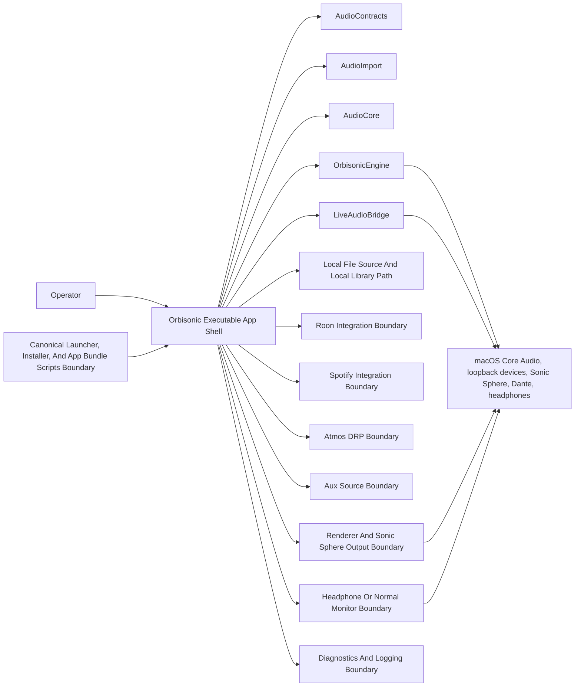

## 2. Local File Playback Flow

Local file playback reads user-selected files or library tracks, probes real source facts, loads or streams PCM, and then schedules playback through the app-owned engine. This path is separate from live loopback capture.

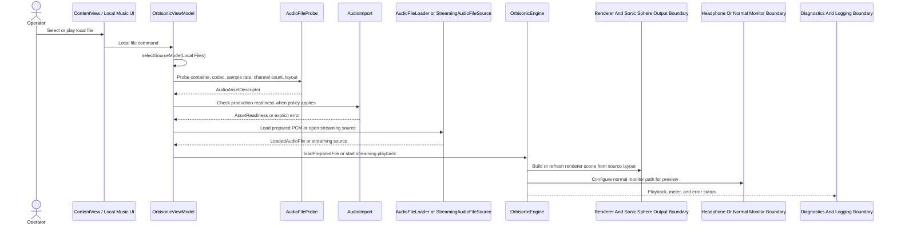

Current local playback surfaces include probing, loading, streaming, local music library state, optional gapless scheduling, metering, renderer scene refresh, and normal monitor setup. Unsupported formats, source-channel overflow, sample-rate policy failures, and decode failures stay visible as errors instead of being hidden. When the selected source changes away from Local Files to Off or Test Tone, stale local playback metadata is cleared so the idle or diagnostic source cannot present the previous track as active.

## 3. Live Roon Loopback Flow

Roon is a selected live source. Roon metadata and transport control are separate from the Core Audio loopback capture path, and a Roon playback line is not proof that Orbisonic is receiving audio.

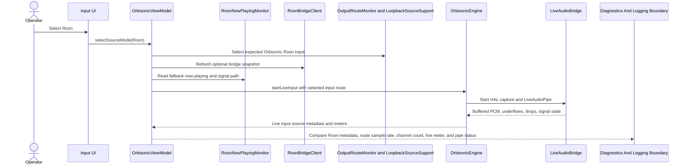

Roon transport controls may go through the local Roon bridge helper, but live admission still depends on the selected loopback input, channel count, sample rate, and captured signal. If Roon reports playback while live meters stay silent, the flow is a route or capture diagnostic case.

## 4. Aux Loopback Flow

Aux is a selected live source for general system or app audio routed into the dedicated Aux loopback input.

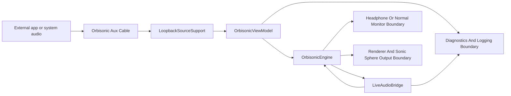

Aux does not parse Roon or Spotify metadata. Its health depends on the expected Aux route, live capture status, active channels, sample rate, channel count, and whether real signal is arriving.

## 5. Atmos DRP Flow

Atmos is a selected live source with Orbisonic-owned Dolby Reference Player transport. V1 intentionally routes DRP output to `Orbisonic Aux Cable` through `AtmosDRPRoutingPolicy`, and Orbisonic captures that same loopback. That temporary route does not make Atmos the same selected source as Aux Cable.

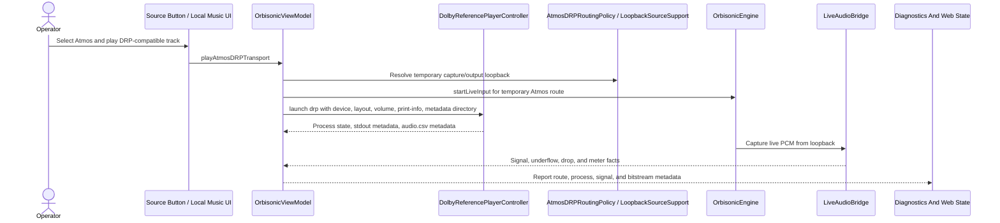

Pause/resume uses process suspension and is reported as experimental. Stop interrupts DRP, then escalates to termination and kill if needed. Previous and next stop the current DRP process and launch an adjacent queue/library track. Seek stays disabled because the DRP CLI does not expose seek.

## 6. Spotify Receiver Flow

Spotify is a selected live source with a dedicated receiver boundary and a dedicated loopback input. Current product policy treats Spotify as stereo unless a future accepted contract changes that.

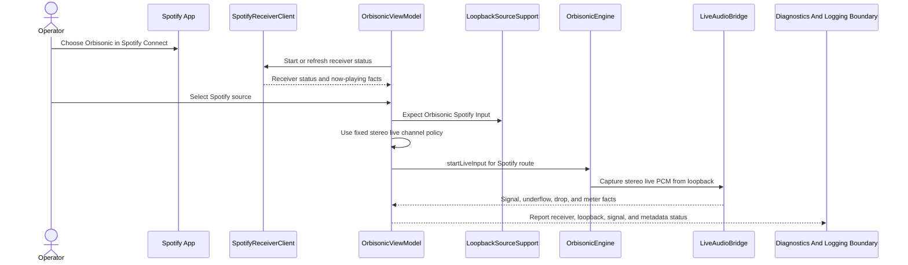

Receiver startup, session metadata, and controls are diagnostic/control surfaces. They do not replace the selected loopback route or live capture facts. Spotify health reporting stays inside the current fixed stereo source policy and must not promote stale local multichannel metadata into a Spotify stream format.

## 7. Renderer And Sonic Sphere Output Flow

The Sonic Sphere output path is the production path. The current app has a legacy app-target renderer model and an in-progress AudioCore planning/kernel layer; both preserve explicit source layout, render mode, and 30.1 production topology semantics.

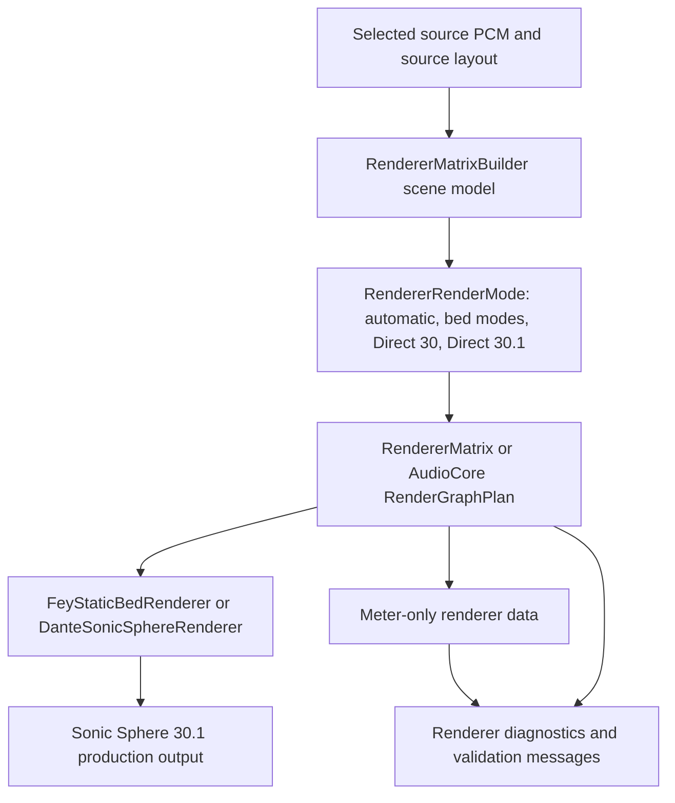

Direct 30 and Direct 30.1 are bypass modes only when source width matches. Renderer output must not be derived from monitor output, and monitor choices must not mutate the Sonic Sphere topology.

## 8. Headphone Or Normal Monitor Flow

The monitor path is for setup, checking, preview, and desktop listening. It is separate from Sonic Sphere production output.

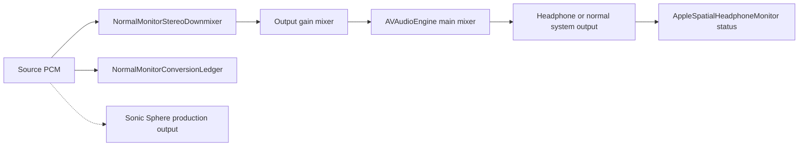

Normal monitor topology is source PCM to stereo downmixer to monitor output. It should not contain an audible Sonic Sphere matrix node, duplicate direct and staged routes, or monitor-volume behavior that changes production output.

## 9. Route Diagnostics Flow

Route diagnostics compare expected source/output identities against Core Audio route facts and live status. They are especially important when a player reports activity but loopback capture is silent.

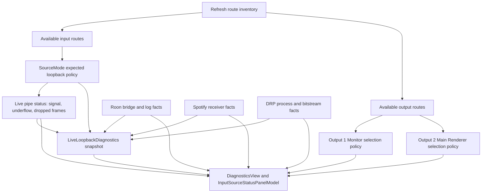

Diagnostics should distinguish missing loopback devices, wrong selected routes, sample-rate mismatch, channel-count mismatch, microphone permission issues, all-zero input, underflows, dropped frames, and feedback-loop risk. For live sources, `LiveLoopbackDiagnostics` produces separate route, sample-rate, channel, signal, buffer, permission, and player/source activity summaries so Roon, Spotify, or DRP activity never counts as proof of captured loopback audio.

## 10. Test Tone Flow

Test tones are diagnostic sources. They can target monitor checks, renderer output channel walks, or multichannel VU activity without implying that external player audio or hardware has been verified.

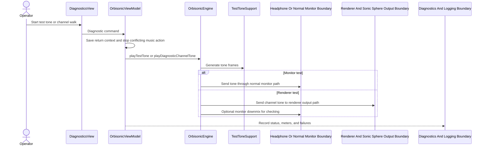

Test tone success proves the commanded diagnostic path ran. Sonic Sphere, Dante, headphones, and loopback hardware still need manual listening or route verification when those physical paths are the question.

## 11. Error And Logging Flow

Orbisonic uses typed errors, user-facing status, bounded diagnostics, and app-managed runtime logs. Logging should aid diagnosis without mutating audio behavior or committing private runtime data.

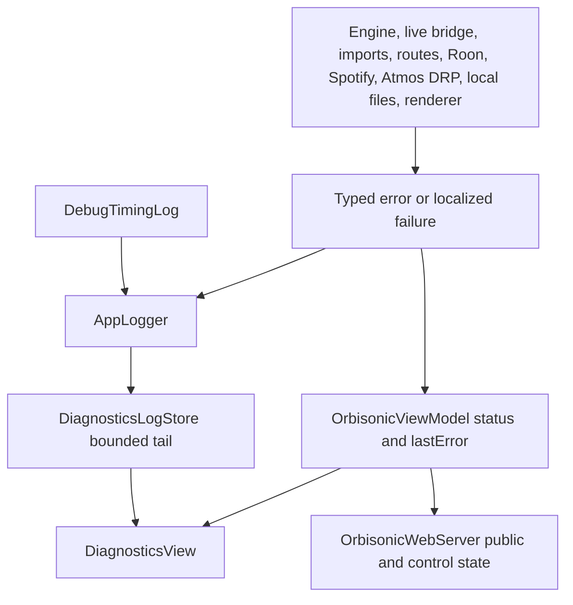

Detailed diagnostics and control state must stay separate from public-facing state. Log reads should remain bounded, and meter display must not alter playback samples.

## 12. Manual Hardware Verification Flow

Automated tests can protect contracts, source isolation, render planning, monitor topology, diagnostics, and local file behavior. They cannot prove physical Sonic Sphere, Dante, loopback, Roon, Spotify, Dolby Reference Player, app signing, microphone permission, or installer behavior unless those environments are actually exercised.

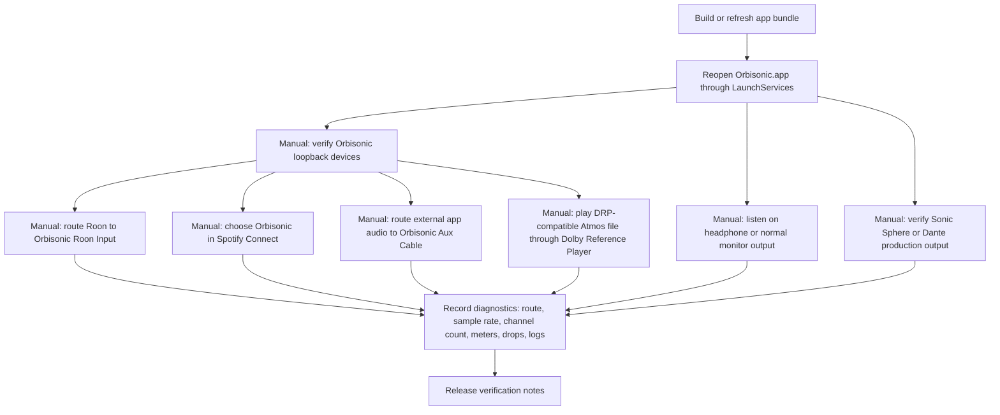

Manual hardware verification should record what was actually tested and avoid claiming success for unexercised routes. For GUI or audio checks after app-code changes, use the app bundle through LaunchServices rather than launching the raw executable.

## Playback And Source State Model

The high-level source state is selected-source based. Source switching stops incompatible live capture and starts the selected source path when appropriate.

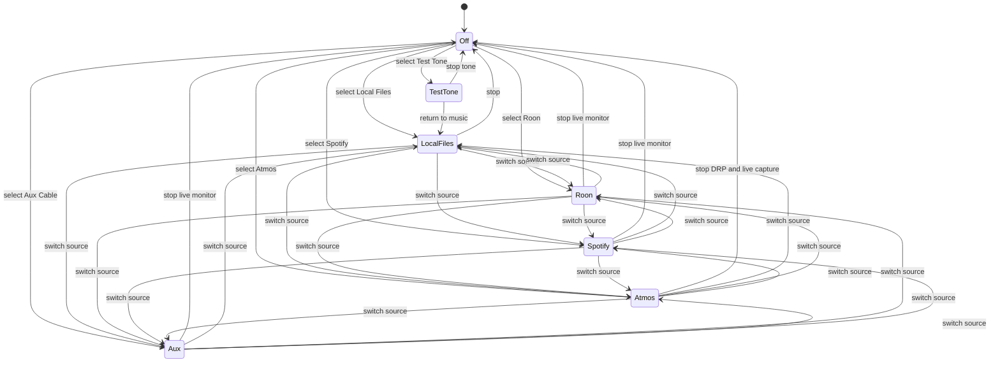

This model is intentionally not a mixer model. Simultaneous source mixing would need a future accepted contract.

## Maintenance Rules For This Document

- Update this document when a prompt changes a source flow, renderer flow, monitor flow, diagnostics flow, or hardware verification path.
- Do not update diagrams to describe planned rewrites unless the plan is explicitly labeled as future-only.
- Keep Mermaid labels plain and aligned with `docs/contracts.md`.
- If a flow cannot be verified without hardware, keep it marked manual.
